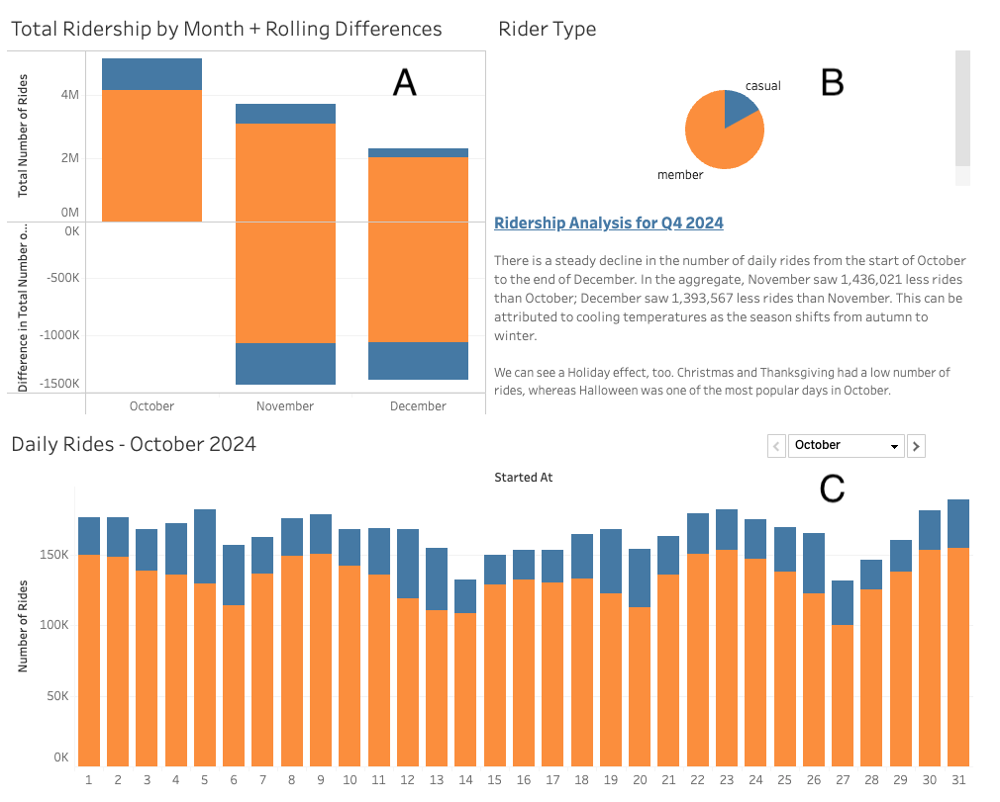
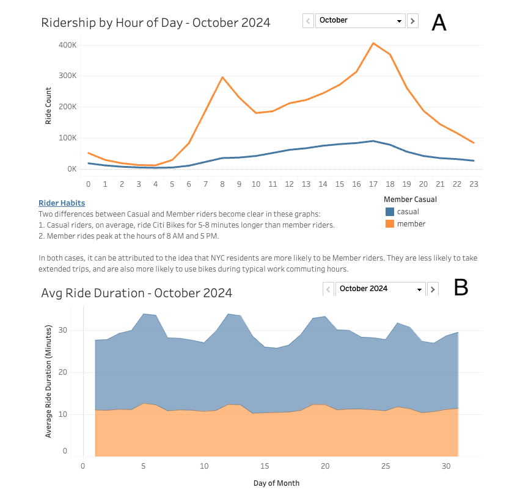
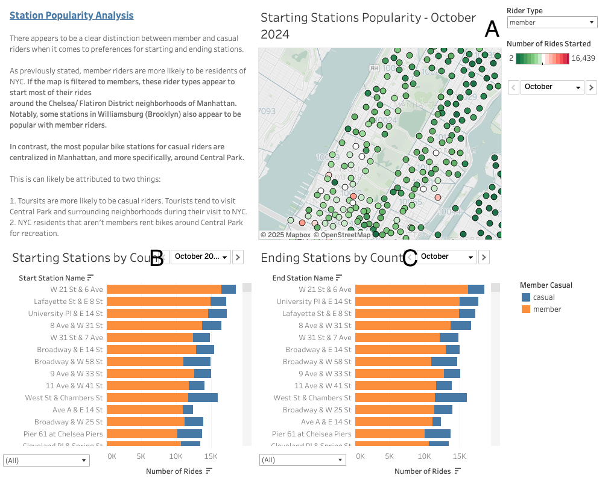
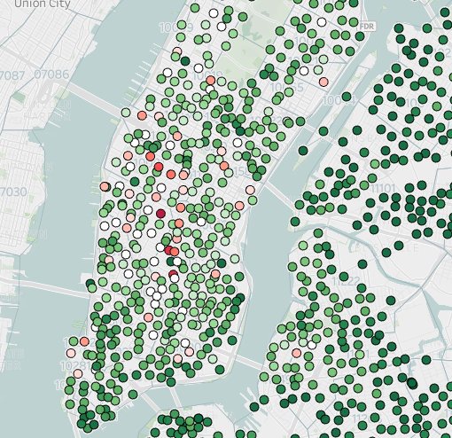
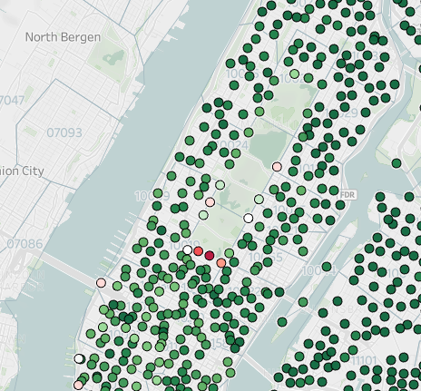

# tableau-challenge

## Workbook Location

[Click here to access the workbook on Tableau Public](https://public.tableau.com/app/profile/geovanni.rubio/viz/Module_018_Challenge/Q42024CitiBike)

## Background

Per Bootcamp Spot Website:
>
> Congratulations on your new job! As the new lead analyst for the New York Citi BikeLinks to an external site. program, you are now responsible for overseeing the largest bike-sharing program in the United States. In your new role, you will be > expected to generate regular reports for city officials looking to publicize and improve the city program.
> 
> Since 2013, the Citi Bike program has implemented a robust infrastructure for collecting data on the program's utilization. Each month, bike data is collected, organized, and made public on the Citi Bike DataLinks to an external site. webpage.
> 
> However, while the data has been regularly updated, the team has yet to implement a dashboard or sophisticated reporting process. City officials have questions about the program, so your first task on the job is to build a set of data reports to provide the answers.

## Assignment Breakdown

1. Download zip files from the CitiBike NYC website for [trip data](https://s3.amazonaws.com/tripdata/index.html).
2. For this assignment, I chose to focus on the last 3 months of 2024. The zip files are rather large in size and contain millions of rows of data.
3. I loaded the CSV files from the zip files into a Jupyter Notebook and used the pandas Python library to take a quick look at the data and also clean it (removing null value rows, for example).
4. After cleaning, I exported the new CSV files to load into Tableau and began my exploratory analysis.

## Analysis

### Number of Rides

I first aimed to get the number of CitiBike rides for my chosen date range (Oct 2024 - Dec 2024), broken down by rider type. 

Member riders comprised the large majority of bike rentals vs Casual riders -- 9.24 million vs 1.88 million, respectively (seciton B in the above screenshot).

The data clearly shows that the number of bike rentals drops significantly as the months progressed.

The number of rides remained steady through the month of October but declined in November, with a sharp drop on the 21st of the month. In total, there were 1,436,021 less rides in November than in October (detailed in section A).

The decline continued in December, with 1,393,567 less rides than November. The sharp decline can be attributed to colder temperatures as the season transitioned from autumn to winter. The average temperature in October was in the 60 degree (Fahrenheit) range. By December, the average temperature was in the 30s-40s.

There appeared to be a Holiday effect, too. There were far less rides on Thanksgiving Day, 11/28 -- the smallest number of rides for the entirety of November. 

December saw the least amount of rides on the days leading up to and including Christmas (the 21st, 22nd, 24th, and 25th). Conversely, Halloween saw the most rides in October.

I opted to include a bar graph of daily ridership. The user can page through the months to see the gradual decline (section C).

### Rider Habits

The Ridership by Hour of Day line graph (section A) shows the total number of rides in a month broken down by hour of day that the ride started. The blue line represents Casual riders and orange represents Member riders.

Member rides peak around the hours of 8 AM and 5 PM. Casual rides follow a small curve showing the most activity in the mid-to-late afternoon. 

The user can page through the months to see that these patterns become less pronounced as rides become less frequent in November and December. Still, the peaks are still present in the Member riders.

Section B shows the average ride duration broken down by day of the momth. The user is also able to page through the months to see changes in data.

We can see that, on average, Member ride durations are shorter than Casual riders. For the most part, member riders tend to ride around 10-12 minutes. This remains consistent throughout the date range. 

Casual riders ride for about 16-18 minutes in October and November, but as ridership falls in December, the average duration falls to the 13-15 minute range.

Both phenomena can be attributed to the possibility that Member riders are more likely to be NYC residents. As residents, they tend to have consistent schedules -- which can explain why Member ridership peaks at typical work commute hours.

Casual riders may be visitors that aren't following a set schedule; or they may be locals riding Citi Bikes for recreation.

There are unusual peaks in aggregate ride duration during certain days of each month. This could be due to public events (parades, etc) that caused delays in commutes.

### Station Popularity

This dashboard shows the most popular destinations to start and end rides in sections B and C.

Section A shows a map of all CitiBike stations in NYC, colored according to its popularity as a starting station. In the aggregate, the most popular stations are based around popular neighborhoods in Manhattan.

If the user filters to Member riders, they will see many popular stations dispersed across Lower Manhattan and some in Williamsburg, Brooklyn:

If the data is filtered to Casual riders, the most popular stations are exclusively in Manhattan, specifically in areas surrounding Central Park:

Once again, this phenomenon can possibly be attributed to the idea that NYC residents are more likely to be Member riders. Central Park is a popular destination for residents and tourists alike, but maybe tourists are more likely to rent CitiBikes as Casual riders in the famous park. Additionally, maybe NYC residents that aren't members rent CitiBikes around Central Park for recreational purposes.

These differences become less pronounced as ridership falls in December.